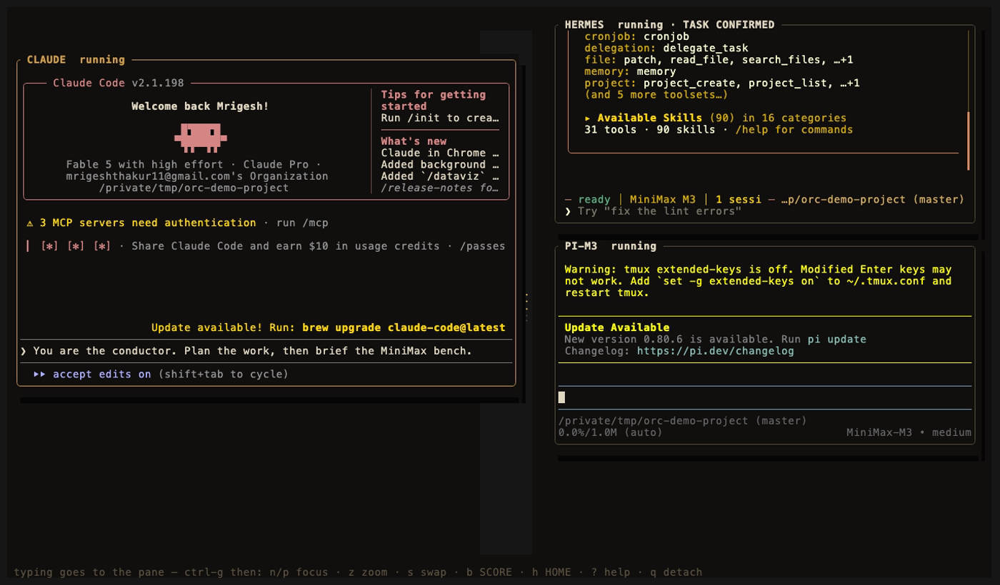
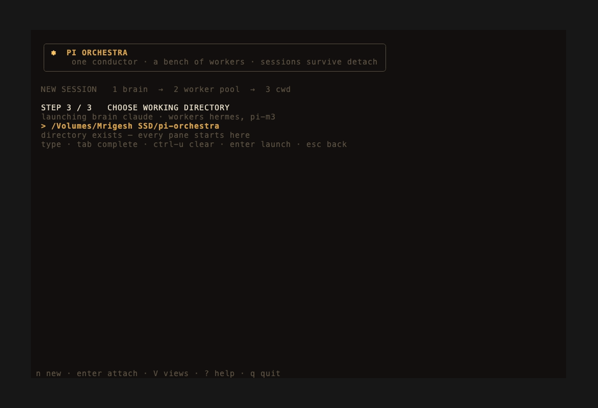
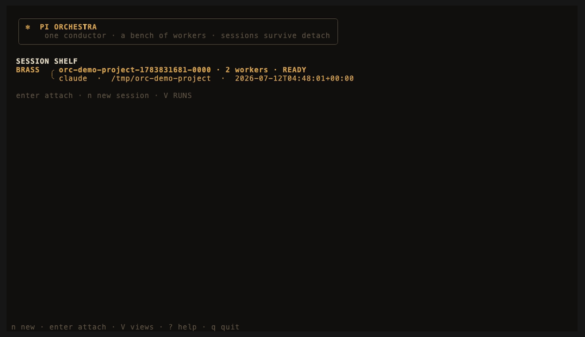
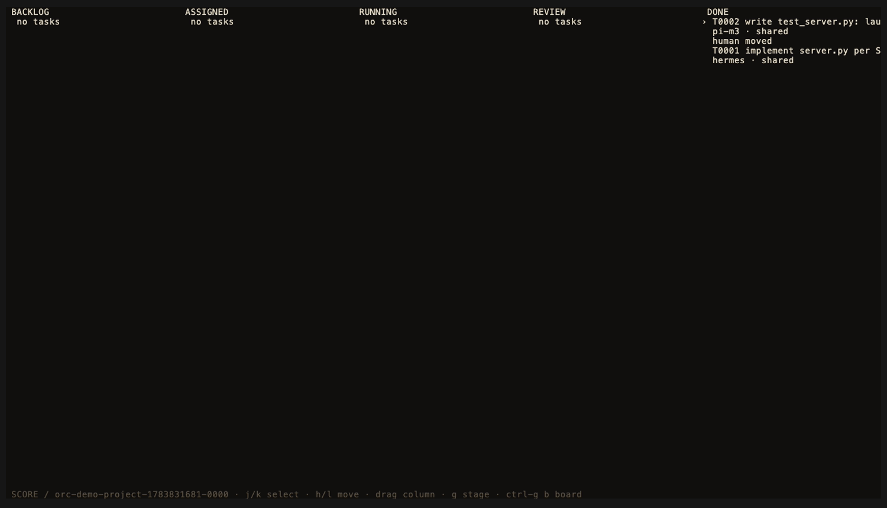

# pi-orchestra

**One expensive conductor. A bench of cheap workers. All in one terminal.**

pi-orchestra is a Rust terminal workspace for orchestrating AI coding agents.
A single high-capability *brain* (Claude Code, Codex, Hermes, or pi) plans and
delegates; a pool of inexpensive MiniMax *workers* (Hermes, pi/MiniMax-M3)
executes focused, bounded briefs. Sessions are durable: close your terminal,
reattach later, and every pane is exactly where you left it.


## Why

Frontier-model subscriptions are expensive and rate-limited; MiniMax coding
plans are cheap and fast. The economical way to run an agent team is to let
the expensive model *think* and the cheap models *type*. pi-orchestra makes
that workflow first-class:

- the brain gets a durable task board and a verified dispatch channel to
  every worker;
- delivery is **confirmed, never assumed** — a task is marked received only
  after the worker's non-interactive interface returns success;
- everything lives in plain, additive JSON under `~/.orchestra`, so the CLI,
  the TUI, and your own scripts see the same state;
- provider traffic flows directly between each harness and its provider.
  There is no API proxy and no key handling.

## Architecture

```text
pi-orchestra client  ← Unix socket →  orcd  → conductor PTY + worker PTYs
        HOME / STAGE / SCORE / RUNS   │
                                      └→ ~/.orchestra plain JSON records
orc run / rpc / task / dispatch / list / quota ─────────────────────┘
```

Three binaries, one data directory:

| Binary | Role |
|---|---|
| `orcd` | Per-user daemon. Owns the PTYs and durable screen state; panes survive client detach and terminal crashes. |
| `pi-orchestra` | The TUI client: HOME (sessions), STAGE (live panes), SCORE (task board), RUNS (usage ledger). |
| `orc` | Headless CLI: delegation, task board, dispatch, registry, quota — scriptable from anywhere, including from the brain itself. |

The daemon starts on demand at `~/.orchestra/orcd.sock` (directory `0700`,
socket `0600`, bounded attachment, stale-socket safety checks, rotating log).
Remote use needs no web server: SSH or mosh in and run `pi-orchestra attach`.

## A real session

STAGE with a live Claude Code brain and both MiniMax workers (Hermes and
pi/MiniMax-M3), each in its own daemon-owned pane. The animated baton
filaments between the conductor card and the bench pulse whenever a pane
produces output; focus hops with `ctrl-g n`:


After a confirmed dispatch the worker's card is labeled `TASK CONFIRMED` —
here Hermes has durably received its brief while the conductor drafts the
next one:



The launch flow — brain, worker pool, working directory:



The durable session shelf after detaching:



SCORE after both workers confirmed delivery and the work was reviewed:



These screenshots are from an actual run (2026-07-12): the Hermes worker was
dispatched "implement `server.py` per SPEC.md" and the pi/MiniMax-M3 worker
"write `test_server.py`" in a scratch repository. Both dispatches returned
exit 0 with confirmed receipts, and the generated test passed against the
generated server on the first run.

## Install

Requirements: macOS or Linux, Rust toolchain (`cargo`), and at least one
harness on your PATH (`claude`, `codex`, `hermes`, or `pi`).

```bash
git clone https://github.com/Legend101Zz/Agent-orchestra.git pi-orchestra
cd pi-orchestra
./install.sh
```

The installer performs a locked release build in an isolated target under
`~/.local/share/pi-orchestra` (override with `ORC_INSTALL_CARGO_TARGET_DIR`)
and links `orc`, `orcd`, and `pi-orchestra` into `~/.local/bin`. Existing
commands are backed up before replacement. The marked `~/.zshrc` and AGENTS
blocks are additive and idempotent. The installer **never** edits
`~/.pi/agent/*`, `~/.claude/settings.json`, or `~/.codex/config.toml`, and it
prints protected-config checksums so you can verify that yourself.

```bash
./uninstall.sh   # removes links and marked blocks; preserves ~/.orchestra
```

Build without installing:

```bash
CARGO_TARGET_DIR=/tmp/pi-orchestra-build cargo build --manifest-path rust/Cargo.toml --release --locked
/tmp/pi-orchestra-build/release/pi-orchestra home
```

## First session

```bash
source ~/.zshrc                 # reload helpers in an already-open shell
command -v orc orcd pi-orchestra
orc version
pi-orchestra home
```

In HOME press `n`:

1. **Choose a brain** — the conductor pane (Claude Code is a natural fit).
2. **Review the worker pool** — Hermes + pi-m3 are preselected offers;
   `space` edits the selection. Unavailable tools are never auto-selected.
3. **Choose a working directory** — the session launches, STAGE opens, and
   every pane starts in that directory.

Close the client any time with `ctrl-g q`; panes keep running in `orcd`.
Reattach with:

```bash
pi-orchestra attach                 # newest durable session
pi-orchestra attach <session-id>
```

## Delegating work

Every Bench pane starts with `ORC_SESSION`, `ORC_PANE_ID`, `ORC_WORKERS`, and
an `ORC_DELEGATE_HINT`, so the brain knows exactly what it may delegate to.
The durable path is the task board plus confirmed dispatch:

```bash
orc task add "small, reviewable task" --session <session-id> --actor human
orc task assign T0001 hermes --run <worker-pane> --session <session-id> --actor brain
orc task start T0001 --session <session-id> --actor brain
orc dispatch send T0001 hermes "bounded brief" --pane <worker-pane> --session <session-id> --actor brain --json
orc task review T0001 --session <session-id> --actor human
orc task move T0001 done --session <session-id> --actor human
```

Dispatch uses each worker's *locally verified* non-interactive interface
(`hermes -z`, `pi -p --no-session`). Missing executables, stopped panes,
timeouts, and non-zero exits are durable failures — never presented as
receipt. Confirmed records write `delivery_confirmed` into task history,
bounded to 16 KiB prompt/output excerpts, and SCORE replays the state after
reattach. No terminal keystrokes are injected.

### Isolated tasks and worktrees

```bash
orc task add "review parser" --isolate --session <id> --actor brain --json
orc task diff T0001 --session <id> --json
orc task merge T0001 --session <id> --actor human --json
```

Isolation creates an owned `orc/<session>/<task>` branch under an owned
worktree root. It refuses dirty, detached, non-Git, reused, symlinked, or
unprovable paths and never auto-resolves merge conflicts.

### Verified worker capabilities

```bash
orc adapter list        # what this machine can honestly offer
```

| Harness | Delivery | Steering | Exact usage |
|---|---|---|---|
| Hermes | `-z/--oneshot`, verified | — | — |
| pi / MiniMax-M3 | `-p --no-session`, verified | `orc rpc` follow-ups | when the completed event contains usage |
| Claude, Codex | interactive pane only | — | — |

`orc adapter list` never contacts a provider; it reports the configured
executable and the *demonstrated* capability. An entry in the registry is not
delivery proof. Existing `~/.orchestra/harnesses.json` files are never
rewritten — add verified `dispatch_args` yourself or leave the worker
visibly unavailable.

## Headless CLI

| Goal | Command |
|---|---|
| Delegate once | `orc run "task" --brain codex` |
| Streaming RPC worker | `orc rpc "task" --brain codex` |
| List / inspect / kill | `orc list` / `orc show <id>` / `orc kill <id>` |
| Send an RPC follow-up | `orc send <id> "message"` |
| Retry / reviewed handoff | `orc retry <id>` / `orc handoff <id> "remaining work"` |
| Usage and savings | `orc stats --json` |
| MiniMax quota | `orc quota` (exit 0 ok / 2 warn / 3 block / 4 unknown) |
| Bound a stalled worker | `orc run "task" --idle-timeout 120` |
| Task board | `orc task add/assign/start/review/move/diff/merge` |
| Confirmed dispatch | `orc dispatch send …` |

Shell helpers installed by the marked block: `deleg8 "task" /path/to/cwd`
and `pi-rpc "task"`.

Quota transport failure fails open and prints `ORC NOTE`; warn and block
levels print `ORC WARNING` / `ORC BLOCKED`, and callers must relay those
lines verbatim. Worker output is untrusted until the brain verifies it.

## Keys

**In STAGE, everything you type goes to the focused pane** — kitty extended
keys, bracketed paste, and mouse coordinates are forwarded raw. Commands
always take the leader first: press `ctrl-g`, release, then one key.
Press the leader twice to send the literal chord to the pane. The leader is
configurable via `app.leader_key` in `~/.orchestra/harnesses.json`
(`ctrl-` plus a letter; keys that collide with enter/tab/escape/flow control
are refused and fall back to `ctrl-g`).

| Keys | Action |
|---|---|
| `n` (HOME) | new session flow |
| `enter` (HOME) | attach selected session |
| `V` (outside STAGE) | cycle HOME / SCORE / RUNS |
| `?` (outside STAGE) | help |
| `ctrl-g n` / `ctrl-g p` | focus next / previous pane |
| `ctrl-g z` | zoom focused pane / restore ensemble |
| `ctrl-g s` | swap focused pane with the next |
| `ctrl-g +` / `ctrl-g -` | resize focused card |
| drag a card header | reposition and persist layout |
| `ctrl-g b` | SCORE board |
| `ctrl-g h` | return HOME |
| `ctrl-g v` | leave STAGE to the views |
| `ctrl-g ?` | help from STAGE |
| `ctrl-g q` | detach (panes keep running) |
| `j/k`, `h/l`, drag (SCORE) | select task, request lifecycle move |
| `g` (SCORE) | focus the linked STAGE pane |
| `V`/`h`/`q` (RUNS) | leave the read-only ledger / quit |
| `R` (dead conductor) | resume when the harness supports it |

When a brain exits, workers stay alive and the pane shows `CONDUCTOR DOWN`
with elapsed time. Recovery uses the harness's real `resume_args`; a harness
without resume support says `RESUME NOT SUPPORTED` — pi-orchestra never
invents it.

## Harness registry

`~/.orchestra/harnesses.json` is plain additive JSON, written atomically;
unknown fields survive round trips. Fresh defaults:

```json
{
  "harnesses": {
    "claude": {"command":"claude","args":[],"resume_args":["--continue"],"roles":["brain","worker"],"adapter":"claude"},
    "codex": {"command":"codex","args":[],"resume_args":["resume"],"roles":["brain","worker"],"adapter":"codex"},
    "hermes": {"command":"hermes","args":["--tui"],"resume_args":[],"roles":["brain","worker"],"adapter":"hermes","dispatch_args":["-z"]},
    "pi-m3": {"command":"pi","args":["--provider","minimax","--model","MiniMax-M3"],"resume_args":[],"roles":["brain","worker"],"adapter":"pi","dispatch_args":["-p","--no-session"]}
  },
  "default_workers": ["hermes", "pi-m3"],
  "max_parallel_workers": 3,
  "app": {"leader_key":"ctrl-g","reduced_motion":false,"theme":"ember"}
}
```

Two themes are supported: `ember` (warm charcoal and brass) and `phosphor`
(CRT green). `reduced_motion: true` disables all animation, including the
HOME avatar. `leader_key` sets the command chord (default `ctrl-g`).

## Measured performance

Release build on an M-series Mac (see `docs/notes/` for raw evidence):

- Unix-socket round trip, 5,000 samples: p50 **13 µs**, p99 **16 µs**.
- PTY input to visible replay, 100 samples: p50 **3.365 ms**, p99 **3.628 ms**.
- Idle daemon and client: **0.0% CPU**; settled daemon RSS ≈ 7.5 MiB.
- A 20,000-line output burst coalesced 19,819 of 19,825 intermediate
  generations across 20 snapshots.
- A four-pane flood ran 2 h 6 m with daemon CPU 21–37% and stable RSS.

## Troubleshooting

- **`command not found: orc`** — open a new shell or `source ~/.zshrc`;
  confirm `~/.local/bin` is on your PATH.
- **A worker shows UNAVAILABLE** — its executable is missing or its adapter
  has no verified `dispatch_args`. Run `orc adapter list` to see exactly
  what is missing; do not force it.
- **`orc run` refuses to start** — it requires a working local `pi` with
  `pi --list-models minimax` listing `MiniMax-M3`. Fix pi or use a Bench
  worker instead; don't reach for `--force`.
- **Quota warnings** — `orc quota` exits 2 (warn) or 3 (block) with an
  `ORC WARNING`/`ORC BLOCKED` line. Blocks honor `--force`, but the message
  must be relayed, not swallowed.
- **Stuck or stale session** — `pi-orchestra attach` replays daemon state;
  `orc task list --session <id>` and `orc list` show the durable record.
  Killing the client never kills panes; killing `orcd` does.

## Development

```bash
cd rust
cargo fmt --check
cargo clippy --all-targets -- -D warnings
cargo test
RUSTDOCFLAGS="-D warnings" cargo doc --no-deps
cargo build --release --locked
```

The former Python implementation was removed only after its behavior was
captured as an immutable fixture corpus
(`rust/crates/orc-core/tests/fixtures/python-v3/`) covering current, legacy,
corrupt, exact-usage, killed, orphaned, RPC, session-linked, retry, handoff,
CJK, combining-mark, and wide-character data. Rust tests compare meaningful
JSON/exit structure and preserve unknown fields.

Historical design, benchmark, and review documents live under `docs/` and
retain their original labels for auditability.
