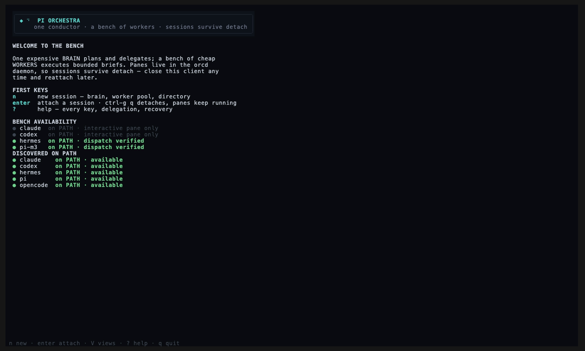
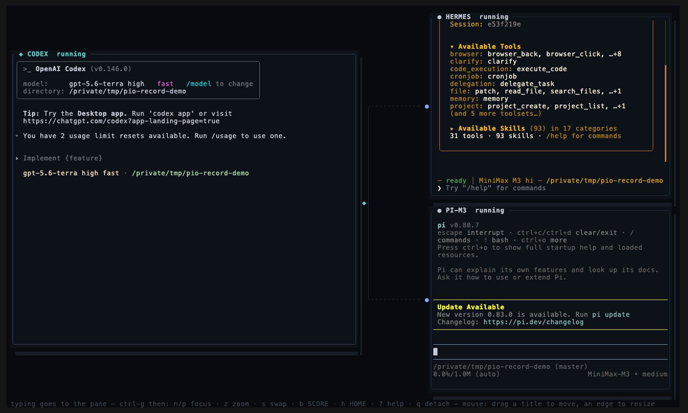
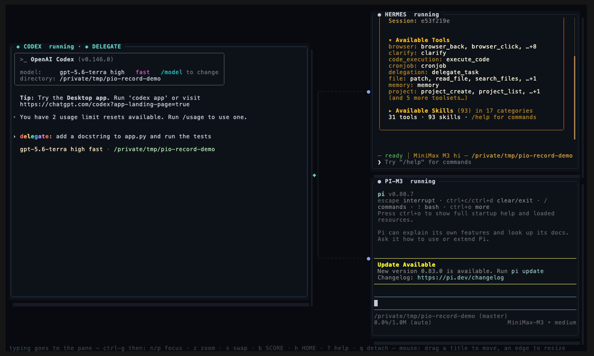
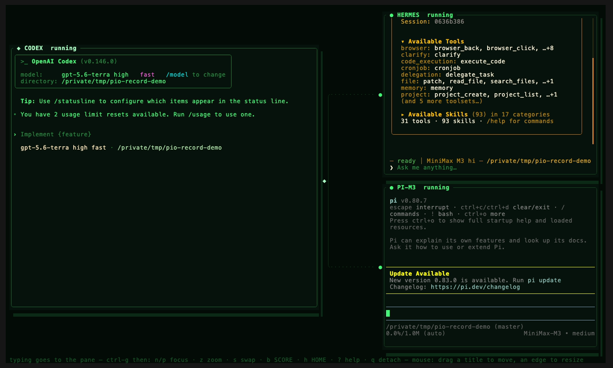
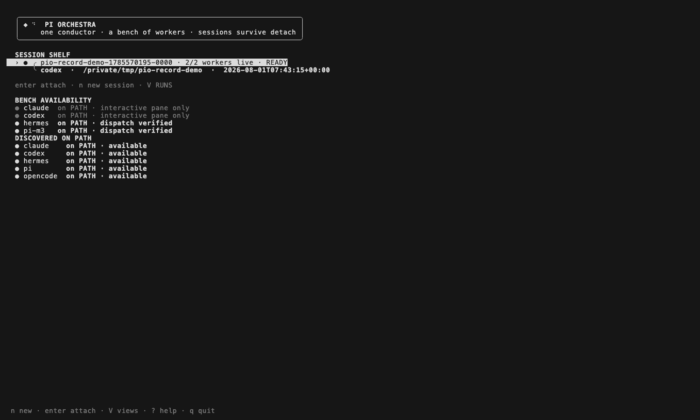

# pi-orchestra

**One expensive conductor. A bench of cheap workers. All in one terminal.**

You are probably already paying for several AI coding subscriptions. Each one
sits in its own terminal, idle most of the time, with its own rate limit that
you hit alone. pi-orchestra turns that pile into one orchestra: a single
frontier model plans and delegates, a bench of cheaper models does the typing,
and the quotas you already own get pooled instead of wasted.

Sessions are durable. Close the terminal, lose the SSH connection, crash the
client — every pane is still there when you come back, because the panes belong
to a daemon, not to the thing drawing them.


*Recorded at `bed5166` in **nocturne**, the flagship theme. Codex conducting,
Hermes and pi/MiniMax-M3 on the bench.*

---

## Contents

- [Why](#why) · [What it actually does](#what-it-actually-does)
- [Install](#install) — [prerequisites](#1-prerequisites) · [install](#2-install) · [**verify**](#3-verify-before-you-trust-it) · [no-install](#building-without-installing) · [uninstall](#uninstall)
- [Your first session](#your-first-session) · [Delegating work](#delegating-work)
- [What each harness can honestly do](#what-each-harness-can-honestly-do)
- [Keys](#keys) · [Themes](#themes-and-terminals)
- [Everything that ships](#everything-that-ships) · [Architecture](#architecture)
- [Troubleshooting](#troubleshooting) · [Known issues](#known-issues) · [Licence](#licence)

## Why

Frontier subscriptions are expensive and rate-limited. Cheap coding plans are
fast and plentiful. The economical arrangement is to let the expensive model
*think* and the cheap models *type* — and to be able to watch it happen.

- The brain gets a durable task board and a verified dispatch channel to every
  worker.
- Delivery is **confirmed, never assumed**: a brief is recorded as received only
  after a worker process actually took it, and "the worker took it" and "the
  worker finished" are two different facts, recorded separately.
- Everything durable is plain, additive JSON under `~/.orchestra`, so the CLI,
  the TUI and your own scripts all see the same state. There is no database.
- Provider traffic goes straight from each harness to its own provider. **There
  is no API proxy and no key handling anywhere in this project.**

## What it actually does

| | |
|---|---|
| **Hosts your CLIs in panes** | Claude Code, Codex, Hermes, pi, OpenCode — real PTYs, owned by a daemon, surviving detach. |
| **Delegates with a contract** | Objective, allowed paths, forbidden actions, acceptance checks, budget — rendered into the brief the worker actually receives. |
| **Isolates the work** | Each contracted task gets its own git worktree, so a worker cannot touch your checkout. |
| **Bounds the blast radius** | Durable per-harness concurrency caps that survive detachment, plus 429 backoff and honest `rate_limited` failure. |
| **Shows you the truth** | A live circuit between conductor and workers, a task board, and a sidecar showing the brief a worker was *really* sent. |
| **Degrades honestly** | Never offers a capability it has not probed. Unavailable is shown, never hidden. |

## Install

### 1. Prerequisites

macOS or Linux, and:

| Need | Check it | Notes |
|---|---|---|
| Rust toolchain | `cargo --version` | 1.91+. Install from [rustup.rs](https://rustup.rs). |
| Git | `git --version` | Needed for worktree isolation. |
| **zsh** | `zsh --version` | See the note below if you use bash. |
| At least one AI CLI | `command -v claude codex hermes pi opencode` | Any one is enough to be useful. |

```bash
cargo --version && git --version && zsh --version
command -v claude codex hermes pi opencode
```

You need **at least one** of those CLIs. With exactly one capable harness,
pi-orchestra says so in as many words and runs a sequential
implementer→reviewer plan instead of pretending to have a panel.

> **bash users:** `install.sh` writes its shell block to `~/.zshrc` and nothing
> else — **zsh is what the installer supports.** The helpers themselves are
> bash-compatible (verified: `bash -n shell/orchestra.zsh` passes, and all three
> functions define and run under bash), so add the line yourself:
> ```bash
> echo 'source "/path/to/pi-orchestra/shell/orchestra.zsh"' >> ~/.bashrc
> ```
> Everything else — the binaries, the daemon, the TUI — is shell-agnostic.

### 2. Install

```bash
git clone https://github.com/Legend101Zz/Agent-orchestra.git pi-orchestra
cd pi-orchestra
./install.sh
```

**Exactly what it does**, in the order it does it:

| Step | What it touches |
|---|---|
| Locked release build | `~/.local/share/pi-orchestra/target` (override with `ORC_INSTALL_CARGO_TARGET_DIR`) |
| Command links | symlinks `pio`, `piod`, `pi-orchestra`, `pio-mcp` into `~/.local/bin`. An existing file at any of those names is **moved to `<name>.pi-orchestra.bak`** first. |
| Rename shims | writes forwarding scripts for the two retired command names from #17, so old muscle memory and old scripts keep working |
| Daemon check | runs `pio daemon status` and warns if a daemon from a previous install is still running |
| Data directory | creates `~/.orchestra/{runs,sessions}`, `chmod 700`, seeds `config.json` if absent |
| Shell block | appends a marked block to `~/.zshrc` (backed up to `~/.zshrc.pi-orchestra.bak` the first time) |
| Claude skills | symlinks `pi-delegate`, `orchestrate`, `deliberate` into `~/.claude/skills/` |
| Codex block | appends a marked block to `~/.codex/AGENTS.md` (backed up first) |

**What it refuses to touch, and how to check that yourself.** The installer never
edits `~/.pi/agent/settings.json`, `~/.claude/settings.json`, or
`~/.codex/config.toml`. It prints their SHA-256 checksums at the end so you can
verify it. Take them yourself first if you want to be certain:

```bash
shasum -a 256 ~/.pi/agent/settings.json ~/.claude/settings.json ~/.codex/config.toml
./install.sh
# compare against the "protected-config checksums" block it prints
```

The one exception is opt-in and off by default: `./install.sh --wire-claude-hook`
registers the `delegate:` trigger hook in `~/.claude/settings.json`. It backs the
file up, merges rather than overwrites, and does nothing at all if the hook is
already registered. Without that flag the trigger grammar is inert, and
`pio doctor` will tell you so.

Both the `~/.zshrc` and `~/.codex/AGENTS.md` blocks are marked and idempotent:
running the installer twice leaves them byte-for-byte identical.

### 3. Verify, before you trust it

Do not skip this. Run it in a **new shell**:

```bash
# 1. the commands exist and are yours
command -v pio piod pi-orchestra pio-mcp
pio version                       # expect: pio 0.4.0+<commit>

# 2. the daemon agrees with the client
pio daemon status                 # 0 = ok · 3 = not running (fine) · 5 = BUILD MISMATCH

# 3. what this machine can honestly offer
pio adapter list

# 4. what each CLI was actually probed to do, and whether `delegate:` is wired
pio doctor                        # exits non-zero while the trigger grammar is inert
```

If `pio adapter list` shows `dispatch=true` for at least one harness, delegation
will work. If it shows `dispatch=false` everywhere, read the line underneath each
entry — it names the missing piece rather than making you guess.

A full end-to-end check, which is what "it works" really means:

```bash
mkdir -p /tmp/pio-check && cd /tmp/pio-check && git init -q
printf 'x = 1\n' > app.py && git add -A && git commit -qm init

pio session create --brain codex --worker hermes --cwd /tmp/pio-check --json | tail -3
SID=$(pio session list --json | python3 -c 'import sys,json;print(json.load(sys.stdin)[0]["id"])')

pio orch delegate --session "$SID" --title "smoke" \
    --objective "Reply with exactly the word PONG and nothing else." \
    --check "output contains PONG" --isolate hermes --json | tail -3
pio orch await --session "$SID" T0001 --json | tail -5
```

On a working install `delegate` returns in well under a second with
`"status": "confirmed"` and `"execution_status": "running"`, and `await` later
reports `"execution_status": "succeeded"` with `"exit_code": 0`. Measured on the
machine this README was written on: `delegate` returned in **0.13 s** while the
worker ran for **12 s**, and the worker's own bytes landed in
`~/.orchestra/dispatches/<session>/…a1.out.log`.

### Building without installing

```bash
CARGO_TARGET_DIR=/tmp/pi-orchestra-build \
  cargo build --manifest-path rust/Cargo.toml --release --locked
```

> ⚠️ **This path does not currently work for running the TUI**, and it fails
> quietly. The client still resolves its daemon by the command name that #17
> retired (`rust/crates/orc-app/src/main.rs:66-72`), which a build tree does not
> contain. On a machine that has installed pi-orchestra before, a locally built
> client silently starts the **installed** daemon and then refuses with a build
> mismatch; on a machine that never has, it cannot start a daemon at all.
> Filed as [#65](https://github.com/Legend101Zz/Agent-orchestra/issues/65), which
> carries the reproduction and a `PATH` shim you can use until it is fixed.
> Otherwise use `./install.sh`.

The `pio` CLI has no such problem and runs fine straight from the build tree.

### Uninstall

```bash
./uninstall.sh
```

Removes the command links (including `pio-mcp`), the marked `~/.zshrc` and
`~/.codex/AGENTS.md` blocks, and the linked skills. **It preserves
`~/.orchestra`** — your sessions, task boards and receipts survive. Delete that
directory by hand if you really want it gone.

## Your first session

```bash
source ~/.zshrc          # or just open a new shell
pi-orchestra home
```

HOME opens with a short teaching screen and a **BENCH AVAILABILITY** strip
showing which harnesses resolve on `PATH` and which have a *verified* dispatch
capability — two different questions, and it shows both.



Press **`n`** and walk three steps:

1. **Choose a brain** — the conductor pane. `j`/`k` to move, `enter` to accept.
2. **Review the worker pool** — sensible workers are preselected; `space`
   toggles. Unavailable tools are never auto-selected.
3. **Choose a working directory** — prefilled with where you launched from.
   `tab` completes a path segment, `ctrl-u` clears the line, and a path that is
   not a directory is refused *before* launch rather than after.

On `enter` the session launches and STAGE opens with every pane running.



The conductor sits top-left with a heavier border. Each worker has its own rail
branching off the spine — one per worker, so you can see *which* one is busy
rather than that *something* is. Drag a pane by its title to move it, or by any
edge to resize; the wiring follows.

Detach with **`ctrl-g q`**. The panes keep running:

```bash
pi-orchestra attach                 # newest durable session
pi-orchestra attach <session-id>
```

Back on HOME, each shelf card reports real pane health — live worker count,
`CONDUCTOR DOWN` with the `R` recovery hint, or `ALL PANES DEAD` after a daemon
restart — so a dead session is never a surprise on attach.

## Delegating work

### From inside a pane — the trigger grammar

Type `delegate:` at the start of what you are saying to the conductor and it
lights up: the word shimmers per-character and the pane's title grows a
`◆ DELEGATE` badge. `orchestrate:` and `deliberate:` are the other two.



The badge is the affordance; what makes it *do* something is a hook plus the
skills, and `pio doctor` reports whether all three parts are actually wired on
your machine rather than assuming. It exits non-zero while the grammar is inert.

`deliberate:` is answered honestly: the judged panel is a V2 feature, so it says
so and offers a real single-worker or self-review fallback instead of faking one.

### From the CLI — the seven verbs

The same seven verbs drive everything, and the MCP server exposes exactly these
seven tools, so the two surfaces cannot drift:

```bash
pio orch plan     --session <id> "title" --objective … --check …
pio orch delegate --session <id> --task T0001 <harness>     # returns after delivery
pio orch status   --session <id> [T0001]
pio orch await    --session <id> T0001                      # blocks for the answer
pio orch review   --session <id> T0001
pio orch cancel   --session <id> T0001
pio orch finish   --session <id> T0001
```

`delegate` returns as soon as the worker has the brief — **the brain does not
block** — and the durable concurrency lease is handed to a detached supervisor
that holds it for the worker's real lifetime. That transfer is what keeps
`max_parallel_workers` meaning something once delegation stopped blocking.

A real run leaves this behind, per attempt:

```
~/.orchestra/dispatches/<session>/
  D-hermes-….json                    the record: delivery and execution, separately
  D-hermes-….a1.out.log              the worker's bytes, and nothing else
  D-hermes-….a1.err.log
  D-hermes-….a1.progress.jsonl       our counters, and nothing else
```

Those two file kinds are deliberately kept apart — one can only ever be believed
about what the *worker* said, the other about what *we* observed. The
[dispatch lifecycle](docs/architecture/dispatch-lifecycle.md) explains why that
separation is the design rather than tidiness.

### MCP

```bash
pio mcp print-config        # ready-to-paste snippets for Claude Code and Codex
```

It prints; it never edits those protected files itself.

## What each harness can honestly do

```bash
pio adapter list        # what this machine can offer — no provider is contacted
```

```console
claude     pane=true dispatch=false steer=false exact_usage=false
    No verified non-interactive, steering, or exact-usage adapter is installed for this harness.
codex      pane=true dispatch=false steer=false exact_usage=false
    No verified non-interactive, steering, or exact-usage adapter is installed for this harness.
hermes     pane=true dispatch=true  steer=false exact_usage=false
    Hermes can receive a bounded --oneshot brief, but has no verified durable steering or exact-usage event.
opencode   pane=true dispatch=false steer=false exact_usage=false
    No verified non-interactive, steering, or exact-usage adapter is installed for this harness.
pi         pane=true dispatch=false steer=true  exact_usage=true
    Pi steering is available only through a live RPC run… The registry has no dispatch_args,
    so bounded delivery is unavailable.
pi-m3      pane=true dispatch=true  steer=true  exact_usage=true
    Pi steering is available only through a live RPC run; exact usage is recorded only when its
    completed event contains usage.
```

Look at the last two lines. **`pi` and `pi-m3` are the same executable** — and
one can take a brief while the other cannot, because `pi-m3` is a profile with
verified `dispatch_args` and bare `pi` is not. The one that cannot says why on
the same line.

That is the whole point: **an entry in the registry is not proof of anything.**
Claude Code and Codex are excellent conductors and pi-orchestra hosts them
happily in a pane; what it will not do is claim they can take a headless brief,
because that was never demonstrated against their real interface. If you have
verified `dispatch_args` for a harness, add them yourself — pi-orchestra will
never rewrite your `harnesses.json` to invent a capability, and will leave the
worker visibly unavailable instead.

`pio doctor` answers the neighbouring question — what each CLI's own `--help`
advertises — and caches per binary, re-probing only when that binary changes.

## Keys

**In STAGE, everything you type goes to the focused pane.** Kitty extended keys,
bracketed paste and mouse coordinates are forwarded raw. Commands take the
leader first: press `ctrl-g`, release, then one key. Press the leader twice to
send the literal chord to the pane. Pasting text that contains your leader byte
cannot fire commands.

The leader is configurable via `app.leader_key` in `~/.orchestra/harnesses.json`
(`ctrl-` plus a letter; keys colliding with enter/tab/escape/flow control are
refused and fall back to `ctrl-g`).

| Keys | Action |
|---|---|
| `ctrl-g` `ctrl-g` | send the literal chord to the pane |
| `ctrl-g n` / `ctrl-g tab` | focus next pane |
| `ctrl-g p` | focus previous pane |
| `ctrl-g z` | zoom focused pane / restore |
| `ctrl-g s` | swap focused pane with the next |
| `ctrl-g +` / `ctrl-g =` | grow focused card |
| `ctrl-g -` | shrink focused card |
| `ctrl-g t` | **cycle theme** — nocturne → ember → phosphor, and it persists |
| `ctrl-g i` | **brief sidecar** — what this worker was really sent |
| `ctrl-g b` | SCORE board |
| `ctrl-g h` | HOME |
| `ctrl-g v` | leave STAGE to the views |
| `ctrl-g ?` | help |
| `ctrl-g q` | detach (panes keep running) |
| drag a title / an edge | move / resize, and it persists |

Outside STAGE the chord is deliberately smaller — only `q`, `h`, `b`, `v`, `?`
and `t`, since there is no pane to operate on — and bare keys work directly:

| Keys | Action |
|---|---|
| `n` (HOME) | new session flow |
| `enter` (HOME) | attach selected session |
| `j`/`k` or arrows | select (HOME, SCORE, RUNS) |
| `space` (worker step) | toggle a worker |
| `tab` / `ctrl-u` (cwd step) | complete a path segment / clear the line |
| `h`/`l` (SCORE) | move the task back / forward through its lifecycle |
| `g` (SCORE) | jump to that task's STAGE pane |
| `/` (RUNS) | search |
| `V` | cycle HOME → SCORE → RUNS |
| `?` | help · `q` quit |
| `R` (dead conductor) | resume, when the harness really supports it |

Bare `?` and `V` are view keys only where no raw input is expected — not in the
HOME launch flow, where you need a literal `V` in a path, and not in a RUNS
search box.

When a brain exits, workers stay alive and the pane shows `CONDUCTOR DOWN`.
Recovery uses the harness's real `resume_args`; one without resume support says
`RESUME NOT SUPPORTED` rather than inventing it.

## Themes and terminals

**Three themes, and the default is `nocturne`** — not ember.

| Theme | Character |
|---|---|
| **nocturne** *(default)* | Stage at night. Near-black blue, cool teal conductor, periwinkle bench, warm gold confirmations. |
| **ember** | Warm charcoal and brass, a firelit study. |
| **phosphor** | CRT green. One hue, five luminances — the 16-colour-safe tier. |

Cycle with `ctrl-g t` on any screen. The choice persists, because the client
asks the daemon to write it rather than writing `~/.orchestra` itself.



Underneath the themes, the client probes what your terminal can actually do and
degrades in layers — truecolor, 256, 16, and **monochrome**, where there is no
colour at all:



Nothing above depends on colour to be legible. Every state pairs with a glyph
(`✓` confirmed, `◔` queued, `◑` running, `✕` failed, `●`/`○` on-PATH), so the
monochrome tier is *usable*, not merely survivable. 29 committed text goldens
hold that property — and they compare colours, not just characters.

`reduced_motion: true` in `harnesses.json` disables every animation.
`NO_COLOR` is honoured for pi-orchestra's own chrome; a CLI running *inside* a
pane still emits its own colours, which is a deliberate decision rather than a
gap.

## Everything that ships

| Surface | Command | Depth |
|---|---|---|
| Trigger grammar | type `delegate:` in a conductor pane | [client](docs/architecture/client.md) |
| Seven verbs, CLI + MCP | `pio orch …` · `pio mcp print-config` | [dispatch lifecycle](docs/architecture/dispatch-lifecycle.md) |
| Capability probe | `pio doctor` | [capability model](docs/architecture/capability-model.md) |
| Verified adapters | `pio adapter list` | [capability model](docs/architecture/capability-model.md) |
| Harness registry | `pio harness list` · `pio harness add` · `pio harness cap` | [data model](docs/architecture/data-model.md) |
| Task board + contracts | `pio task add/assign/start/review/move/diff/merge` · `pio task brief` | [dispatch lifecycle](docs/architecture/dispatch-lifecycle.md) |
| Confirmed dispatch | `pio dispatch send/list/drain` | [dispatch lifecycle](docs/architecture/dispatch-lifecycle.md) |
| Worktree isolation | `pio task add --isolate` · `task diff` · `task merge` | [data model](docs/architecture/data-model.md) |
| Brief sidecar | `ctrl-g i` on a worker | [client](docs/architecture/client.md) |
| Quota guard | `pio quota` (0 ok · 2 warn · 3 block · 4 unknown) | [capability model](docs/architecture/capability-model.md) |
| Usage ledger | `pio top` · `pio stats --json` | [crate map](docs/architecture/crate-map.md) |
| Daemon control | `pio daemon status` (0 ok · 3 stopped · 5 mismatch) · `pio daemon restart` | [daemon](docs/architecture/daemon.md) |
| One-shot workers | `pio run` · `pio rpc` · `pio send` · `pio retry` · `pio handoff` | — |

Shell helpers from the marked block: `deleg8 "task" [cwd]`, `pi-rpc "task"`, and
`bench-dispatch <task> <harness> <pane> "brief"`.

Quota transport failure fails open and prints `ORC NOTE`; warn and block levels
print `ORC WARNING` / `ORC BLOCKED`, and callers must relay those lines verbatim.
Worker output is untrusted until the brain verifies it.

## Architecture

**[docs/architecture/](docs/architecture/)** — diagrammed, and checked against
the code rather than against this README.

Three binaries, one data directory, one Unix socket:

| Binary | Role |
|---|---|
| `piod` | Per-user daemon. Owns every PTY and the durable screen state; panes survive client detach and terminal crashes. |
| `pi-orchestra` | The TUI: HOME (sessions), STAGE (live panes), SCORE (task board), RUNS (usage ledger). |
| `pio` | Headless CLI — scriptable from anywhere, including from the brain itself. |

Start with [the overview](docs/architecture/README.md), then
[the dispatch lifecycle](docs/architecture/dispatch-lifecycle.md), which is the
hardest thing here to understand from the source and the most useful thing to
have drawn.

Remote use needs no web server: SSH or mosh in and run `pi-orchestra attach`.

## Measured performance

Release build on an M-series Mac:

- Unix-socket round trip, 5,000 samples: p50 **13 µs**, p99 **16 µs**.
- PTY input to visible replay, 100 samples: p50 **3.365 ms**, p99 **3.628 ms**.
- Idle daemon and client: **0.0% CPU**; settled daemon RSS ≈ 7.5 MiB.
- A 20,000-line burst coalesced **19,819 of 19,825** intermediate generations
  across 20 snapshots.
- Six workers all producing at once repaint in **0.157 ms**, against a 16 ms budget.
- A four-pane flood ran 2 h 6 m with daemon CPU 21–37% and stable RSS.

Raw evidence is in [`docs/archive/notes/`](docs/archive/notes/).

## Troubleshooting

- **`command not found: pio`** — open a new shell or `source ~/.zshrc`; confirm
  `~/.local/bin` is on your `PATH`.
- **`daemon build X does not match client`** — `piod` persists across installs,
  so after an update the running daemon may still be the old build.
  `pio daemon status` shows both and exits 5. Detach clients, then
  `pio daemon restart` (it refuses while live panes exist unless `--force`, and
  lists exactly what would be lost). *The error text still names the pre-#17
  command; the one to run is `pio daemon restart`. See
  [Known issues](#known-issues).*
- **A worker shows UNAVAILABLE** — its executable is missing, or its adapter has
  no verified `dispatch_args`. `pio adapter list` names which. Don't force it.
- **`delegate:` does nothing** — run `pio doctor`. It checks all three parts
  (hook installed, hook registered, skills linked) and exits non-zero while any
  is missing. `./install.sh --wire-claude-hook` registers the hook for you.
- **`ISOLATION REQUIRED: … worktree is unavailable`** — a contracted task takes
  an isolated git worktree, so it needs a repo *with at least one commit*.
  Commit once, or use an uncontracted task (no `--objective`/`--check`), which
  needs no worktree.
- **A delegated worker seems to do nothing** — it is not running in the pane you
  are watching; it is a separate headless process, usually in a different
  directory. Press `ctrl-g i` on the worker to see the brief it was really sent,
  which dispatch it belongs to, and what it has produced so far.
- **The sidecar says "no complete line observed since T"** — that is not a
  euphemism. Output is read a line at a time, and a worker that block-buffers its
  stdout delivers nothing until it exits. Measured: a Python worker printing
  every 50 ms delivered its first line at 2.187 s; the same worker with `-u`
  delivered at 0.018 s. pi-orchestra will not guess on the worker's behalf.
- **`pio run` refuses to start** — it needs a working local `pi` with
  `pi --list-models minimax` listing `MiniMax-M3`. Fix pi or use a Bench worker;
  don't reach for `--force`.
- **Quota warnings** — `pio quota` exits 2 (warn) or 3 (block) with an
  `ORC WARNING`/`ORC BLOCKED` line. Blocks honour `--force`, but the message
  must be relayed, not swallowed.
- **A task stops animating on STAGE** — fixed in #51; on an older build, a task
  past its eighth history event stopped updating silently.
- **Stuck or stale session** — `pi-orchestra attach` replays daemon state;
  `pio task list --session <id>` and `pio list` show the durable record. Killing
  the client never kills panes; killing `piod` does.
- **A session's board wedges** — `.board.lock` has no stale reclaim yet, so a
  process killed at the wrong moment can hold it forever. Delete the lock file by
  hand. See [Known issues](#known-issues).

## Known issues

Open, and worth knowing before you file a duplicate:

| # | What |
|---|---|
| [#54](https://github.com/Legend101Zz/Agent-orchestra/issues/54) | `.board.lock` has no stale reclaim — a process killed while holding it wedges that session's board until the file is deleted by hand. |
| [#55](https://github.com/Legend101Zz/Agent-orchestra/issues/55) | A worker's saved `stdout` is not capped for one adapter — measured 25× over the documented limit, with nothing saying it had been truncated. |
| [#58](https://github.com/Legend101Zz/Agent-orchestra/issues/58) | `DispatchBrief`'s `extra` map puts #55's oversized `stdout` back within reach. |
| [#59](https://github.com/Legend101Zz/Agent-orchestra/issues/59) | The `⏻ CONDUCTOR DOWN` overlay has never been visible — it is drawn before the pane's cell blit and erased by it in the same frame. |
| [#60](https://github.com/Legend101Zz/Agent-orchestra/issues/60) | One test asserts a fixed 1.5 s wall-clock bound and fails under load, on `main` as well as on any branch. |
| [#61](https://github.com/Legend101Zz/Agent-orchestra/issues/61) | `clip_ellipsis` pushes a hard `…` on the ASCII tier, so the glyph register's elide entry is honoured by one module only. |
| [#62](https://github.com/Legend101Zz/Agent-orchestra/issues/62) | **The brief sidecar is undiscoverable** — `ctrl-g i` appears in neither the help screen nor the footer legend. Until that lands, this README is where you find out it exists. |
| [#63](https://github.com/Legend101Zz/Agent-orchestra/issues/63) | The last clause of #49's objective is undischarged: the brain is never shown the result. |
| [#64](https://github.com/Legend101Zz/Agent-orchestra/issues/64) | `~/.orchestra/dispatches` is never pruned, and `read_briefs` is O(records in session) on the render path. |
| [#65](https://github.com/Legend101Zz/Agent-orchestra/issues/65) | The #17 command rename is incomplete in three user-facing places — the HOME welcome text, two build-mismatch messages, and the daemon lookup that breaks the no-install path above. |

Also known and unfixed: seating a non-Claude brain shows a live `DELEGATE` badge
even where `install.sh` reports the grammar as not wired — the TUI and the
installer can contradict each other on one machine.

## Development

```bash
cd rust
cargo fmt --all -- --check
cargo clippy --workspace --all-targets -- -D warnings
cargo test --workspace
RUSTDOCFLAGS="-D warnings" cargo doc --workspace --no-deps
cargo build --release --locked
```

All five, every time. `tools/check-doc-links.sh` verifies that every in-repo path
citation resolves. How the project is tested — call-site mutation checking,
goldens, and the fixture corpus inherited from the deleted Python implementation
— is written up in
[docs/architecture/testing.md](docs/architecture/testing.md).

Process: [WORKFLOW.md](WORKFLOW.md) · conventions and gates:
[AGENTS.md](AGENTS.md) · the human's review checklist:
[ANTI-SLOP.md](ANTI-SLOP.md). Historical working documents live in
[`docs/archive/`](docs/archive/) and are not maintained.

## Licence

MIT — see [LICENSE](LICENSE). Copyright © Mrigesh Thakur.
