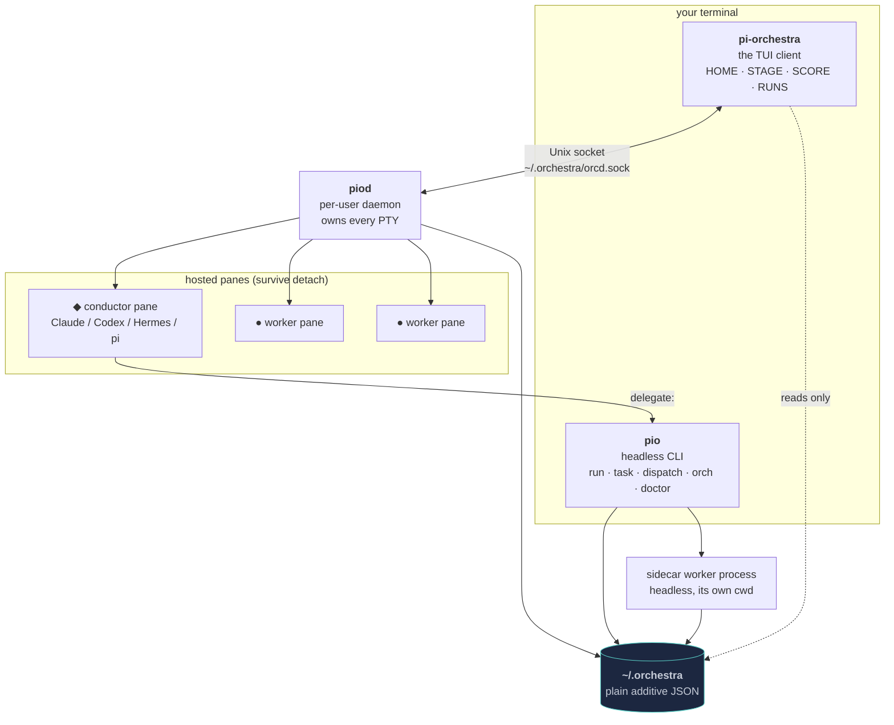

# pi-orchestra architecture

Three binaries, one data directory, one Unix socket. This page is the map; each
section links to the page that goes deep. Read it top to bottom and you will
know where any given behaviour lives.

Every claim here is checked against the code at `bed5166`, and the load-bearing
ones name a file and line so you can check them in one click.

| Page | What it answers |
|---|---|
| [The crate map](crate-map.md) | What the eight crates are, how they depend on each other, and why the split falls where it does. |
| [The dispatch lifecycle](dispatch-lifecycle.md) | What actually happens between `delegate` and an answer. **Start here if you read only one.** |
| [The daemon](daemon.md) | PTY ownership, snapshot coalescing, the socket protocol, build-mismatch detection. |
| [The client](client.md) | HOME/STAGE/SCORE/RUNS, the render path, the leader-key router, the degradation tiers. |
| [The data model](data-model.md) | The `~/.orchestra` layout, additive JSON, atomic writes, board locking, the history window. |
| [The capability model](capability-model.md) | Why an entry in the registry is not proof of anything. |
| [How this is tested](testing.md) | Five gates, call-site mutation checking, goldens, and the inherited fixture corpus. |

## The shape of the system



Two things in that diagram are worth pausing on, because they are the two most
common misreadings of this project.

**The client never writes `~/.orchestra`.** It reads, and it asks the daemon to
write. That is not a stylistic rule — it is why changing a theme from inside the
TUI needed a new protocol message rather than a one-line file write (issue #37).
The daemon is the only writer on the client's side of the socket.

**A delegated worker does not run in the pane you are looking at.** It is a
separate headless process, usually in a different directory. This surprises
everybody once — somebody filed [#45](https://github.com/Legend101Zz/Agent-orchestra/issues/45)
after watching a seated Hermes sit idle and concluding the delegation had failed.
It had not; it had gone somewhere they could not see. The brief sidecar
(`⌃g i`) exists to say so out loud, and its header always carries the negation
*"sidecar worker, not this pane's CLI"*.

## Why a daemon at all

Because panes must outlive the client. Close the terminal, lose the SSH
connection, crash the client — the conductor and the workers keep running,
because their PTYs are owned by `piod`, not by whatever is drawing them.
Reattaching replays the daemon's own screen state, so a pane comes back exactly
where it was rather than blank.

That single requirement is what forces most of the rest of the design:

- The daemon must hold live terminal state, so it parses vt100 itself
  (`orc-pty`) rather than storing raw bytes.
- Two clients may watch the same pane, so screen state is *sampled*, never
  queued — see [coalescing](daemon.md#coalescing).
- The client must not be trusted with durable state, so all writes go through
  the socket.
- A protocol version alone cannot tell a same-version daemon from a
  *differently-built* one, so the handshake compares a build identifier
  (`orc-proto/src/lib.rs:24`) and refuses a mismatch.

## The vocabulary

The metaphor is load-bearing — the code uses these words, and so does the UI.

| Term | Means |
|---|---|
| **◆ conductor** (brain) | The one expensive model. Plans, decomposes, delegates. One per session. |
| **● bench** | The pool of cheap workers available to receive briefs. |
| **╺━━╸ baton** | The filament drawn between conductor and worker. It pulses while a pane *produces output* — a condition, not an event. |
| **▶ message in flight** | A discrete thing that *was sent*. Crosses its connector exactly once and lands. Deliberately distinguishable from the baton by shape, behaviour and colour, so removing any one still leaves them tellable apart. |
| **session** | A durable set of panes plus a task board, under one id. Survives detach. |
| **dispatch** | One delivery of one brief to one worker, with a durable record. |
| **task** | A board entry with a lifecycle: `backlog → assigned → running → review → done`. |

## The one rule everything else follows from

**Confirmed, never assumed.** Nothing is recorded as having happened because it
probably happened. Mechanically, that shows up as two independent axes on every
dispatch rather than one status field:

- **delivery** — did the brief reach a worker process? `pending → queued /
  confirmed / failed`
- **execution** — what did that worker then do? `starting → running →
  succeeded / failed / orphaned`

Both are in `orc-core/src/dispatch.rs:67` and `:86`. Collapsing them is exactly
the bug [#49 phase 1](https://github.com/Legend101Zz/Agent-orchestra/issues/49)
fixed: STAGE used to report the answer arriving about a tenth of a second after
the job went out, every time, because "the worker's process started" was the
only event that existed. Measured on a worker told to take 1.5 s, the hand-off
confirms at 69 ms and the answer arrives at 1.63 s. Before that branch both were
the same instant.

The same rule has a floor it cannot clear, and the code says so rather than
papering over it: partial worker output is read with `read_until(b'\n')`, so
nothing is observable until a newline arrives, and whether one arrives is the
*child's* decision. A Python worker printing every 50 ms delivered its first
line at 2.187 s — i.e. nothing until exit — while the same worker with `-u`
delivered at 0.018 s. So the UI may say *"no complete line observed since T"*
and is forbidden, by a test, from saying "thinking", "quiet" or "no output".
The reasoning is at `orc-core/src/dispatch_progress.rs:40-53`.

## Where the code is

```
rust/crates/
  orc-core/      domain logic — dispatch, tasks, quota, adapters, contracts
  orc-app/       the TUI client
  orc-cli/       the `pio` command
  orc-daemon/    `piod`
  orc-tui/       the standalone RUNS ledger, embedded by orc-app
  orc-proto/     the wire protocol between client and daemon
  orc-pty/       PTY hosting and vt100 capture
  orc-mcp/       the MCP stdio server
```

48,892 lines of Rust across eight crates. The
[crate map](crate-map.md) has the per-crate breakdown and the dependency graph.
