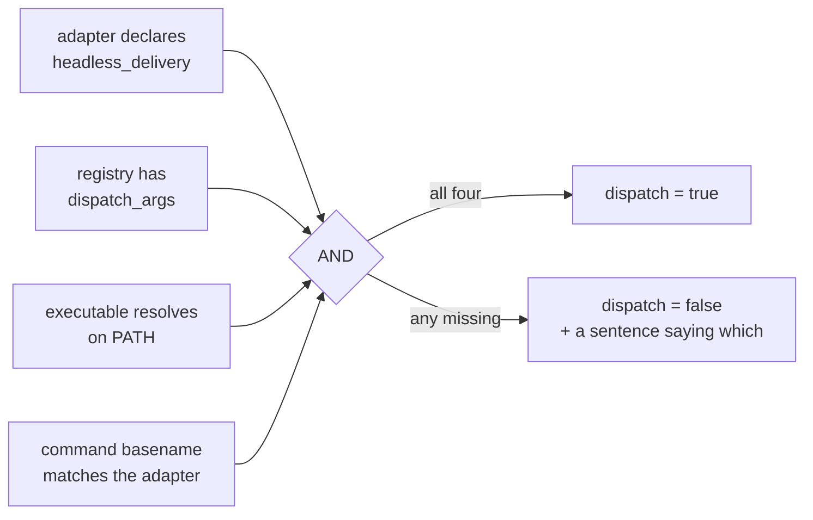

# The capability model

The rule: **pi-orchestra never offers a capability it has not verified.** An
entry in the registry is not proof of anything.

This page explains the machinery that enforces that, because it is small,
unusual, and the thing most likely to be misread as bureaucracy.

## The gate

Whether a harness can receive a bounded brief is the **AND of four independent
facts**, three of which are checked at call time:



That is `summarize_harness`, `orc-core/src/adapter.rs:107-140`:

```rust
let headless_delivery = declared.headless_delivery
    && configured_dispatch
    && executable.is_some()
    && verified_command;
```

The fourth condition is the one nobody expects. `command_matches_adapter`
(`adapter.rs:94`) compares the configured command's **basename** against the
adapter's known executable name. Pointing the `hermes` adapter at a binary that
is not called `hermes` degrades it rather than trusting the label — because the
adapter's capabilities were verified against a specific program's real
interface, and a different program with the same adapter name is a different
program.

## The static table is deliberately tiny

`capabilities(adapter)` (`adapter.rs:55`) knows about exactly **two** adapters
with any verified capability:

| Adapter | pane | dispatch | steer | exact usage |
|---|:-:|:-:|:-:|:-:|
| `hermes` | ✓ | ✓ | — | — |
| `pi` | ✓ | ✓ | ✓ | ✓ |
| *everything else* | ✓ | — | — | — |

Claude, Codex and OpenCode fall to the `_` arm. They are excellent interactive
brains and pi-orchestra hosts them happily in a pane; what it will not do is
claim they can take a headless brief, because that was never demonstrated
against their real `--help`.

Each arm carries a plain-language degradation sentence that the CLI prints
verbatim rather than paraphrasing.

## What it looks like

The clearest demonstration is two profiles of **the same binary** disagreeing,
which is what makes "a registry entry is not proof" concrete rather than
abstract:

```console
$ pio adapter list
claude     pane=true dispatch=false steer=false exact_usage=false executable=/opt/homebrew/bin/claude
    No verified non-interactive, steering, or exact-usage adapter is installed for this harness.
codex      pane=true dispatch=false steer=false exact_usage=false executable=/Users/me/.local/bin/codex
    No verified non-interactive, steering, or exact-usage adapter is installed for this harness.
hermes     pane=true dispatch=true  steer=false exact_usage=false executable=/Users/me/.local/bin/hermes
    Hermes can receive a bounded --oneshot brief, but has no verified durable steering or exact-usage event.
opencode   pane=true dispatch=false steer=false exact_usage=false executable=/Users/me/.opencode/bin/opencode
    No verified non-interactive, steering, or exact-usage adapter is installed for this harness.
pi         pane=true dispatch=false steer=true  exact_usage=true  executable=/Users/me/.local/bin/pi
    Pi steering is available only through a live RPC run; exact usage is recorded only when its
    completed event contains usage. The registry has no dispatch_args, so bounded delivery is unavailable.
pi-m3      pane=true dispatch=true  steer=true  exact_usage=true  executable=/Users/me/.local/bin/pi
    Pi steering is available only through a live RPC run; exact usage is recorded only when its
    completed event contains usage.
```

`pi` and `pi-m3` are the *same executable*. `pi-m3` is a seeded profile carrying
`dispatch_args: ["-p", "--no-session"]`; bare `pi` was auto-registered by
discovery and has none. So one can take a brief and the other cannot, and the
one that cannot **says why in the same line**. No amount of the binary being
present changes that answer.

`pio adapter list` never contacts a provider. It reports the configured
executable and the *demonstrated* capability, and it never rewrites an existing
`harnesses.json` — add verified `dispatch_args` yourself or leave the worker
visibly unavailable.

## Discovery vs. capability vs. availability

Three different questions, deliberately not collapsed:

| Question | Command | Answers |
|---|---|---|
| What is installed? | `pio harness list` | scans `PATH` for known harnesses, records path + version + first/last seen |
| What can it do? | `pio doctor` | probes each harness's own `--help` for eight capabilities |
| What may I offer right now? | `pio adapter list` | the gate above, evaluated now |

`pio doctor` asks whether each tool can run headless, resume a session, use
tools, pick a model, emit machine-readable output, report usage, be cancelled,
and control its working directory. It caches per tool and re-probes only when
that tool's binary actually changes, or on `--refresh`.

The separation matters because **capability is not availability**:
`probed_capabilities` returns last-known capabilities for a harness that has
since left `PATH`. Dispatch therefore gates on `locate_executable` separately —
knowing what a tool *could* do is not knowing it is *there*.

Missing tools are shown as `unavailable`, never hidden. `●` means on PATH, `○`
means not, and the glyph carries it so a monochrome terminal reads the same.

## Building the invocation

Once the gate passes, `orc-core/src/invocation.rs` builds the command line from
what the probe proved — not from a hardcoded table:

- tools that take the job as a plain argument: `claude -p "…"`, `pi -p "…"`
- tools that need a sub-command: `codex exec "…"`, `opencode run "…"`
- extras like machine-readable output or a working-directory flag are added
  **only** when the probe proved that tool supports them

A refusal names the missing capability — `non_interactive`, say — and exits
non-zero, rather than guessing or hanging.

One documented exception, and it is worth knowing because it looks like a
violation: codex's template carries a fixed `--skip-git-repo-check`. A worker's
orchestrator-assigned cwd is not guaranteed to be a git repo, and without that
flag `codex exec` fails with *"Not inside a trusted directory"* — so codex could
never run as a probe-driven worker at all. It lives in a probe-independent
`fixed` flags slot, and it is not a dangerous-skip flag.

## Honest degradation, end to end

With exactly one capable adapter family on the machine, pi-orchestra prints the
mandated sentence verbatim:

> One capable harness detected. Parallel cross-harness deliberation is
> unavailable. Running a sequential plan with self-review.

and then still delivers the whole pipeline — durable session, isolated worktree,
bounded dispatch, sequential implementer→reviewer, acceptance evidence, final
receipt.

The load-bearing honesty call there is that **diversity is counted by adapter
family, not registry key**. Two model profiles of the same CLI can alternate
implementer and reviewer roles, but the report still says `self_review`.
pi-orchestra never manufactures independence it does not have, and duplicate
labels never conjure it either.

## Known gap

`StageState::trigger_wired` is a single global `~/.claude` probe applied to
**every** brain pane regardless of harness. Seat a `pi-m3` or `opencode` brain
and it shows a live `DELEGATE` badge for a grammar that `install.sh` reports as
NOT wired in the same run — the TUI and the installer contradicting each other
on one machine. It is the exact "never claim a capability that wasn't probed"
rule this page describes, violated in one place. It merged as known debt with
[#45](https://github.com/Legend101Zz/Agent-orchestra/issues/45) and is not fixed
here.
