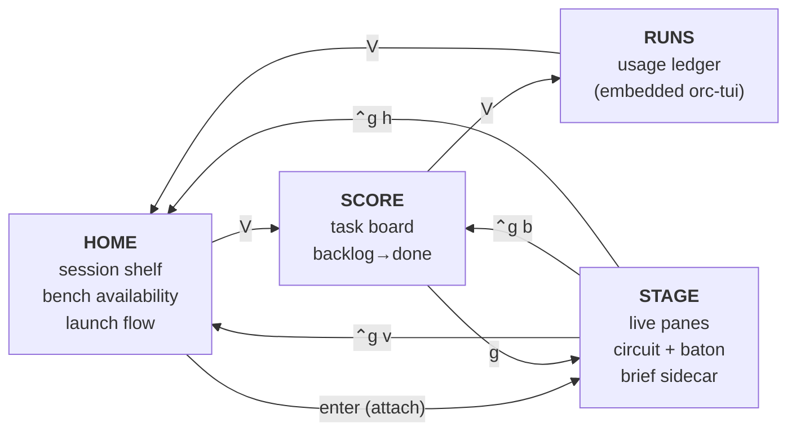
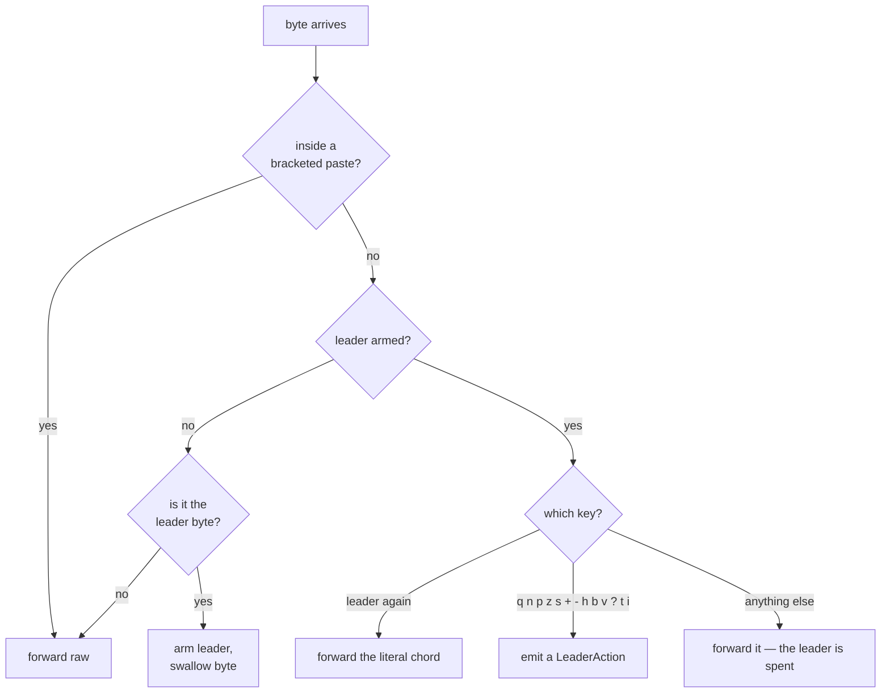
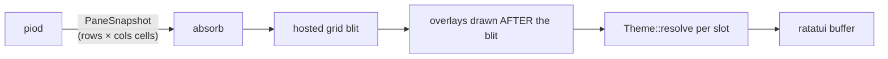

# The client (`pi-orchestra`)

Four screens, one leader key, and a hard rule about who owns your keystrokes.

## The four screens



`V` cycles the views, but not blindly: from HOME it goes to SCORE **only if a
session is attached**, otherwise straight to RUNS (`orc-app/src/lib.rs:3257-3268`).
There is no empty board to land on.

## Who owns your keystrokes

**In STAGE, everything you type goes to the focused pane.** Kitty extended keys,
bracketed paste and mouse coordinates are forwarded raw. That is not a
convenience — a hosted Claude Code or vim needs its keys unmangled, and a client
that swallowed some of them would be unusable.

So commands take a leader first: press `ctrl-g`, release, then one key.

`RawRouter::route` (`orc-app/src/lib.rs:1374`) is the whole mechanism, and it is
worth reading because it is only ~55 lines and it is exact:



Three details that are easy to miss and all deliberate:

- **Bracketed paste disarms the leader entirely.** The router tracks the last
  six bytes and flips a `paste` flag on `ESC[200~` / `ESC[201~`
  (`lib.rs:1418-1427`). Pasting text containing your leader byte cannot fire
  commands.
- **Pressing the leader twice sends the literal chord** to the pane, so nothing
  is unreachable.
- **A bare `i` still reaches the pane.** `⌃g i` opens the brief sidecar, but the
  comment at `lib.rs:1398-1403` spells out the cost: taking `i` costs a user only
  the two-byte `<leader>i` sequence, which `<leader><leader>i` still delivers —
  a vim user's insert key is untouched.

### The full key table

**STAGE** (via `RawRouter::route`, `lib.rs:1381-1408`):

| Key | Action |
|---|---|
| `⌃g` `⌃g` | send the literal leader chord to the pane |
| `⌃g q` | detach (panes keep running) |
| `⌃g n` / `⌃g tab` | focus next pane |
| `⌃g p` | focus previous pane |
| `⌃g z` | zoom / restore |
| `⌃g s` | swap focused pane with the next |
| `⌃g +` / `⌃g =` | grow focused card |
| `⌃g -` | shrink focused card |
| `⌃g h` | HOME |
| `⌃g b` | SCORE |
| `⌃g v` | leave STAGE to the views |
| `⌃g ?` | help |
| `⌃g t` | cycle theme |
| `⌃g i` | brief sidecar on the focused pane |

**Outside STAGE**, the chord table is deliberately smaller — the pane operations
have nothing to act on. `handle_leader_chord` (`lib.rs:3574`) accepts only
`q`, `h`, `b`, `v`, `?`, `t`.

Bare keys work outside STAGE because there is no pane to protect, except in
three places where raw input is expected (`lib.rs:3249-3251`): STAGE itself, the
HOME launch flow (you need a literal `V` in a path), and a RUNS text input.

| Key | Screen | Action |
|---|---|---|
| `n` | HOME | new session flow |
| `enter` | HOME | attach selected session |
| `j` / `k` (or ↑↓) | HOME, SCORE, RUNS | select |
| `space` | HOME (worker step) | toggle a worker |
| `tab` / `ctrl-u` | HOME (cwd step) | complete a path segment / clear |
| `h` / `l` | SCORE | move the task back / forward through the lifecycle |
| `g` | SCORE | jump to that task's STAGE pane |
| `/` | RUNS | search |
| `V` | outside STAGE | cycle views |
| `?` | outside STAGE | help |
| `q` | outside STAGE | quit |

## The render path



**Overlays must be drawn after the pane's cell blit.** This is the load-bearing
ordering rule in the render layer, and it is stated as such in the design sheet
(`docs/design/visual-identity.md`, "The brief sidecar"). It is also the rule the
`⏻ CONDUCTOR DOWN` overlay currently gets wrong: it is drawn *before* the blit
and erased by the pane's own grid in the same frame, so it has never been
visible. That is filed as
[#59](https://github.com/Legend101Zz/Agent-orchestra/issues/59) and is not fixed
here.

## Themes and degradation tiers

Three themes, and the default is **nocturne** — not ember:

```rust
pub const ALL: [Self; 3] = [Self::Nocturne, Self::Ember, Self::Phosphor];
```
— `orc-app/src/theme.rs:195`, with `#[default]` on `Nocturne` at `:184`.

| Theme | Role | Character |
|---|---|---|
| **nocturne** | flagship, default | Stage at night. Near-black blue, cool teal conductor, periwinkle bench, warm gold confirmations. |
| **ember** | anchor | Warm charcoal and brass, a firelit study; olive confirmations. |
| **phosphor** | anchor, mono | CRT green. One hue, five luminances, 16-colour safe. |

Cycle with `⌃g t` on any screen; the client asks the daemon to persist it, since
the client is forbidden from writing `~/.orchestra` itself.

Orthogonally, the client probes what the terminal can actually display
(`theme.rs:124`):

| `ColorTier` | Applies when | What you get |
|---|---|---|
| `TrueColor` | 24-bit terminal | the design's native form |
| `Ansi256` | xterm-256 | nearest index from the sheet's own column |
| `Ansi16` | 16-colour | nearest of sixteen |
| `Monochrome` | `NO_COLOR`, `TERM=dumb` | no colour at all — glyph, bold and reverse-video only |

**Colour is never load-bearing alone.** Every state pairs with a glyph — `✓`
confirmed, `◔` queued, `◑` in progress, `✕` failed, `⏻` conductor down, `●`/`○`
for on-PATH — so the monochrome tier is *usable*, not merely survivable. A test
fails the build if any hex literal appears outside the theme map, and the goldens
compare colours, not just characters.

The tiers are a design commitment, not a fallback ladder bolted on afterwards:
(1) monochrome must be usable, (2) 16 ANSI colours must be readable,
(3) truecolor makes it beautiful. Minimum viewport is 80×24; below that you get
a resize prompt.

## The STAGE circuit

One rail per worker, not one rail total. A socket on the conductor, a spine
running down the gap between the columns, and a branch into each worker — so a
glance tells you *which* worker is busy, which a single shared line never could.
Routing follows the panes when you drag them, because it is computed from real
geometry rather than a formula.

Below about 100 columns there is no gap to route through. Rather than silently
stop drawing (which is what it used to do, at sizes *above* the design's own
80×24 minimum), each worker gets a short rail inlaid in its own top border and
the legend leads with `connectors inlaid — too narrow to route`. You lose the
routing, not the information, and it says so.

Two vocabularies share that geometry and stay separable:

- the **baton** pulses while a pane *is producing* — a three-cell packet, loops
- a **message in flight** is a discrete thing that *was sent* — one directional
  cell (`▶` out, `◀` back), crosses once, lands

They differ by shape, behaviour **and** colour, so removing any one still leaves
them tellable apart. That is why the message packet has no trail: a trail costs
the "single directional cell" rule, and with it the shape leg — the one that
survives when colour is removed.

Six workers all producing at once repaints in **0.157 ms** against a 16 ms
budget.

## The brief sidecar (`⌃g i`)

A band at the top of a worker card showing the brief that worker was *really*
sent, which dispatch it belongs to, which directory it ran in, and — the point —
the words **"sidecar worker, not this pane's CLI"**.

It exists because the work does not happen in the CLI you are looking at, and
somebody reasonably concluded from that that delegation was broken
([#45](https://github.com/Legend101Zz/Agent-orchestra/issues/45)). The header
carries that negation at every width, degrading `sidecar worker, not this pane's
CLI` → `not this pane's CLI` → `not this pane` → `not here`. It never says
"delivered to this pane".

It is not modal: it never takes focus, never swallows a keystroke, and the chord
is its own exit. It states its own cost on its rule row —
`COVERING 7 OF 20 ROWS · ⌃g i closes` — and nothing is resized or lost, because
the next frame after closing restores the rows from the daemon's own buffer.

Truncation **replaces, never appends**: the last row becomes
`… +{N} more lines · {size} brief`, so a count can never be mistaken for content,
and `{N}` is exact rather than "many".
