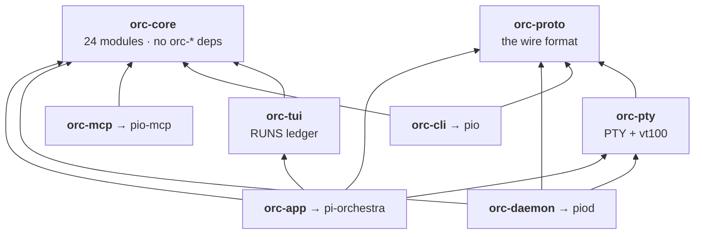

# The crate map

Eight crates, four binaries, 48,892 lines of Rust.

## Dependency graph



Two crates depend on nothing else in the workspace: `orc-core` (all domain
logic) and `orc-proto` (the wire format). Everything else is built on top of
those two. There are no cycles and no crate reaches sideways into a peer's
internals.

## Line counts

Counted as `.rs` lines under each crate, including its `tests/` directory:

| Crate | `src/` | `tests/` | total | Binary |
|---|---:|---:|---:|---|
| `orc-core` | 12,530 | 6,242 | **18,772** | — |
| `orc-app` | 14,707 | 1,065 | **15,772** | `pi-orchestra` |
| `orc-cli` | 2,459 | 4,521 | **6,980** | `pio` |
| `orc-daemon` | 2,545 | 0 | **2,545** | `piod` |
| `orc-tui` | 2,353 | 0 | **2,353** | — |
| `orc-proto` | 847 | 122 | **1,013** | — |
| `orc-pty` | 762 | 0 | **762** | — |
| `orc-mcp` | 241 | 454 | **695** | `pio-mcp` |
| | | | **48,892** | |

Reproduce with:

```bash
cd rust/crates
for c in */; do c=${c%/}
  printf '%-12s %7s\n' "$c" "$(find "$c" -name '*.rs' -exec cat {} + | wc -l)"
done
```

Two things the table tells you that the prose might not. `orc-core` and
`orc-cli` carry more test code than some crates carry code — `orc-cli` is 65%
tests, because the CLI is the surface most likely to drift from the MCP server
and the parity is asserted rather than assumed. And `orc-daemon`, which owns
every PTY in the system, is only 2,545 lines: it deliberately does almost
nothing except own things.

## What lives where, and why

### `orc-core` — the domain, and the only crate that decides anything

24 modules. The largest by far, and the one to read first.

| Module | Lines | What it owns |
|---|---:|---|
| `dispatch.rs` | 1,552 | The dispatch record, the two status axes, delivery, reconciliation. |
| `tasks.rs` | 1,251 | The task board: lifecycle, history, the durable event log. |
| `orch.rs` | 907 | The seven normalized verbs shared by the CLI and MCP. |
| `dispatch_supervisor.rs` | 843 | The detached process that outlives the caller and owns the worker. |
| `report.rs` | 682 | Final receipts: usage, cost, verdicts, run links. |
| `dispatch_progress.rs` | 646 | Per-attempt byte logs and the counter journal. |
| `probe.rs` | 634 | `pio doctor` — what each harness can actually do. |
| `runner.rs` | 530 | Running one worker and extracting its answer. |
| `bench.rs` | 495 | Sessions, panes, the harness registry. |
| `spawn_guard.rs` | 469 | Durable concurrency leases, so a cap survives detachment. |
| `contract.rs` | 440 | Task contracts v2: objective, allowed paths, checks, budget. |
| `metrics.rs` | 412 | Usage and savings accounting. |
| `invocation.rs` | 409 | Building the right command line for a probed harness. |
| `ratelimit.rs` | 372 | 429 detection and jittered backoff. |
| `single_harness.rs` | 369 | The honest one-CLI fallback. |
| `control.rs` | 368 | Operator-console configuration. |
| `discovery.rs` | 345 | Finding known harnesses on `PATH`. |
| `quota.rs` | 317 | The subscription guard and its thresholds. |
| `trigger_grammar.rs` | 277 | `delegate:` / `orchestrate:` / `deliberate:`. |
| `registry.rs` | 276 | Run records, atomic writes, `~/.orchestra` paths. |
| `adapter.rs` | 173 | Verified capability declarations. |
| `model.rs` | 166 | Config, defaults. |
| `harness_models.rs` | 155 | Model profiles per harness. |
| `inbox.rs` | 101 | Per-run message inbox. |

The rule that keeps this crate honest: **it never renders and never talks to a
socket.** It returns data. Everything about how that data looks is somebody
else's problem, which is why the same `orch.rs` drives both `pio orch` and the
MCP server without the two being able to drift.

### `orc-app` — the TUI client

The biggest single `src/` at 14,707 lines, and the one place where the visual
identity is realised. Four screens (HOME, STAGE, SCORE, RUNS), the leader-key
router, the render path from `PaneSnapshot` to cells, the theme and glyph
registers, the STAGE circuit, the baton, the brief sidecar. See
[the client](client.md).

It embeds `orc-tui` rather than reimplementing the ledger, which is why RUNS
looks like the rest of the app instead of a different program.

### `orc-cli` — `pio`

Every headless verb: `run`, `rpc`, `list`, `show`, `kill`, `quota`, `stats`,
`send`, `retry`, `handoff`, `config`, `budget`, `top`, `dispatch`, `adapter`,
`harness`, `doctor`, `task`, `daemon`, `orch`, `mcp`, `session`.

65% of it is tests. That ratio is deliberate: `orch.rs` is shared with the MCP
server, and a test asserts *set equality* against `Verb::ALL` so that an eighth
CLI verb without an eighth tool fails the build rather than shipping a silent
asymmetry.

### `orc-daemon` — `piod`

Owns PTYs and screen replay, and is under standing orders to do nothing else:

> The daemon owns hosted PTYs and screen replay. It must never render UI or
> make orchestration policy decisions.
> — `orc-daemon/src/lib.rs:4`

See [the daemon](daemon.md).

### `orc-tui` — the RUNS ledger

A standalone operator console (`pio top`) that `orc-app` embeds as its RUNS
screen. It predates the shell and keeps its own key handling, which is why the
shell intercepts `t` before it reaches the embed — `orc-tui` carries its own
older two-theme set, and letting it handle theme cycling would swap a palette in
behind the map's back and shell out to a binary with no `config` subcommand
(`orc-app/src/lib.rs:3609-3617`).

### `orc-proto` — the wire format

Request and response types, `PaneSnapshot`, `TerminalCell`, and three constants
that matter more than their size suggests:

- `PROTOCOL_VERSION: u16 = 1` (`:17`)
- `BUILD_IDENTIFIER` (`:24`) — compared during the hello handshake, because a
  version number cannot distinguish a same-version daemon built from different
  code.
- `TASK_HISTORY_WINDOW: usize = 8` (`:204`) — the newest eight history entries
  a task summary carries. This one has bitten the project twice; see
  [the data model](data-model.md#the-history-window).

### `orc-pty` — PTY hosting and vt100 capture

Owns child PTYs, parses their output into a live screen, and produces bounded
snapshots. 2,000 rows of scrollback, capped at 200×400. Also home to
`trigger.rs`, the `delegate:` grammar as a reusable primitive.

> This crate owns child PTYs and vt parsing. It must never implement client
> policy, task mutation, or provider traffic interception.
> — `orc-pty/src/lib.rs:4`

### `orc-mcp` — `pio-mcp`

The smallest crate, and intentionally so: 241 lines of `src/` against 454 lines
of tests. It exposes `orc-core`'s seven `orch_*` verbs over MCP stdio and adds
no logic of its own. Everything it can do, `pio orch` can also do, because both
call the same functions.
