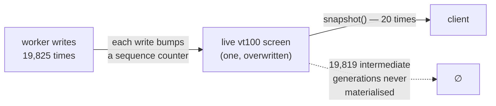
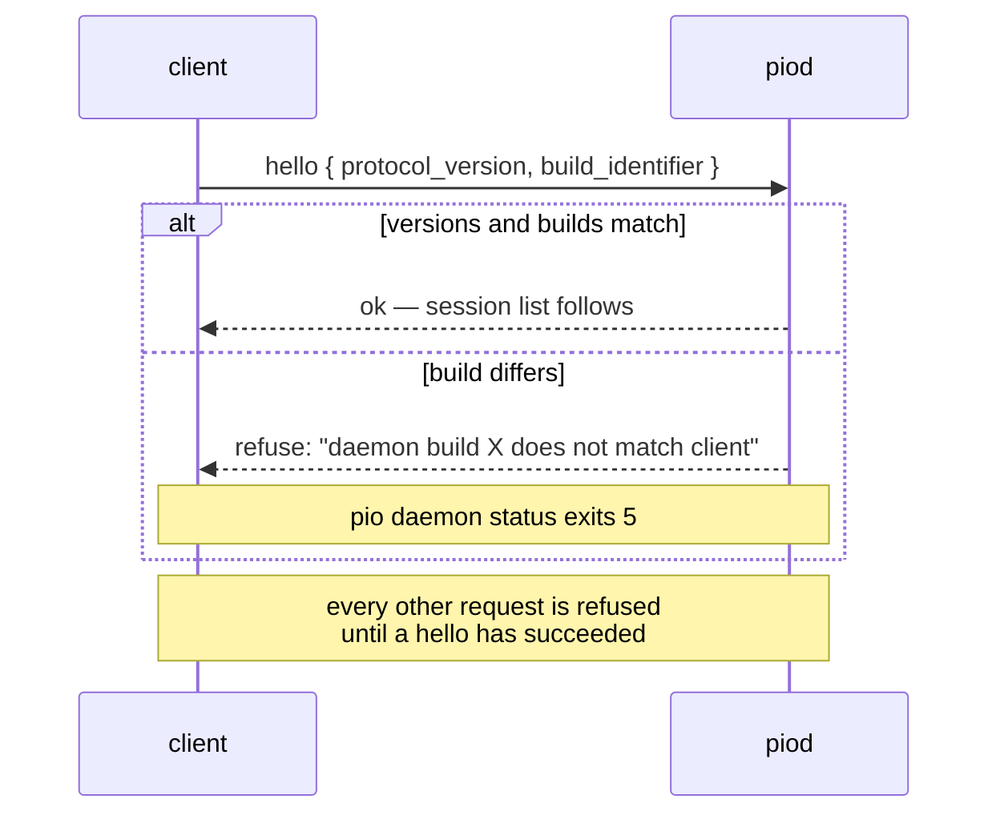

# The daemon (`piod`)

`piod` exists for one reason: **panes must outlive the client.** Everything else
about it follows from that, and it is under standing orders to do nothing more.

> The daemon owns hosted PTYs and screen replay. It must never render UI or make
> orchestration policy decisions.
> — `orc-daemon/src/lib.rs:4`

2,545 lines. It is the smallest thing that can own every terminal in the system.

## PTY ownership

Each pane is a child process on a real PTY, owned by the daemon, not by the
client drawing it. `orc-pty` hosts the child, reads its output on its own thread,
and feeds a vt100 parser that maintains a **live screen** — not a byte log.

That distinction is the whole reattach story. If the daemon kept raw bytes, a
reattaching client would have to replay the entire history through a parser to
know what is on screen. Because the daemon keeps a parsed screen, reattaching is
a single snapshot.

Bounds, from `orc-pty/src/lib.rs:19-21`:

```rust
const SCROLLBACK_ROWS: usize = 2_000;
const MAX_ROWS: u16 = 200;
const MAX_COLS: u16 = 400;
```

A pane is capped at 200×400 cells regardless of what a client asks for, so no
client can make the daemon allocate without limit.

## Coalescing

Two clients may watch the same pane, and a producing worker can emit far faster
than any terminal repaints. So screen state is **sampled, never queued.**



The mechanism is six lines (`orc-pty/src/lib.rs:272-278`): `snapshot()` reads the
current sequence, swaps it into `last_snapshot_sequence`, and if the new value
jumped by more than one, adds the difference to a `coalesced_updates` counter.

```rust
let sequence = self.sequence.load(Ordering::Acquire);
let previous = self.last_snapshot_sequence.swap(sequence, Ordering::AcqRel);
if sequence > previous.saturating_add(1) {
    self.coalesced_updates
        .fetch_add(sequence - previous - 1, Ordering::Relaxed);
}
```

There is no queue to drain and no backlog to fall behind on: the cost of a
pane producing 20,000 lines is the same as one producing 20, because the client
only ever sees the screen as it is *now*. The counter exists so the daemon can
report honestly how much it skipped rather than implying it showed everything.

Measured: a 20,000-line burst coalesced **19,819 of 19,825** intermediate
generations across 20 snapshots.

## The socket

```
~/.orchestra/orcd.sock
```

- The directory is forced to `0700` and the socket to `0600`
  (`orc-daemon/src/lib.rs:1045`, `:1075`) — on every start, not just creation.
- At most **16 concurrent clients** (`MAX_CLIENTS`), and at most **1 MiB per
  message** (`MAX_MESSAGE_BYTES`). A client cannot exhaust the daemon by
  connecting repeatedly or by sending one enormous frame.
- Stale-socket safety: a socket file left by a dead daemon is detected and
  replaced rather than blindly bound or blindly deleted.
- It starts on demand. There is no service to install and nothing to enable.

Remote use needs no web server: SSH or mosh in and run `pi-orchestra attach`.

## The hello handshake, and why a version number is not enough



`PROTOCOL_VERSION` is `1` and has been since the beginning. It is not the
interesting half:

> `PROTOCOL_VERSION` alone cannot distinguish a same-version daemon running
> different code.
> — `orc-proto/src/lib.rs:21`

`BUILD_IDENTIFIER` (`orc-proto/src/lib.rs:24`) starts with the crate version and
carries the build. This matters because **`piod` persists across installs**: you
rebuild, you relink the binaries, and the daemon still running is the old one.
Without the build check, a new client would talk to an old daemon and the
symptoms would be subtle and awful. With it, you get a refusal and an exit code.

`install.sh` probes for exactly this and prints a warning rather than ending on
"done." while the daemon is stale:

| `pio daemon status` | Means |
|---|---|
| 0 | running the installed build |
| 3 | not running (it starts on demand) |
| 5 | **build mismatch** — detach clients, then `pio daemon restart` |

`pio daemon restart` refuses while live panes exist unless `--force`, and lists
exactly what would be lost first. Killing the client never kills panes; killing
`piod` does.

## What the daemon will not do

- **It does not render.** It ships cells; the client decides what they look
  like. This is why themes are a client concern and the daemon has never heard
  of `nocturne`.
- **It does not make orchestration policy.** It has no opinion about which
  worker should get a task. Dispatch runs in `orc-core`, driven by `pio`.
- **It does not proxy providers.** There is no API proxy and no key handling
  anywhere in this project; each harness talks to its own provider directly.
- **It does not inject keystrokes.** A dispatch is a child process with a brief
  on its command line or stdin, never characters typed into somebody's pane.

## The one thing it does decide

The daemon truncates a task's history to the newest `TASK_HISTORY_WINDOW = 8`
entries when it builds a summary for the client (`orc-proto/src/lib.rs:204`).
That is a daemon-side bound on a client-side concern, and it has bitten this
project twice — see [the history window](data-model.md#the-history-window).
