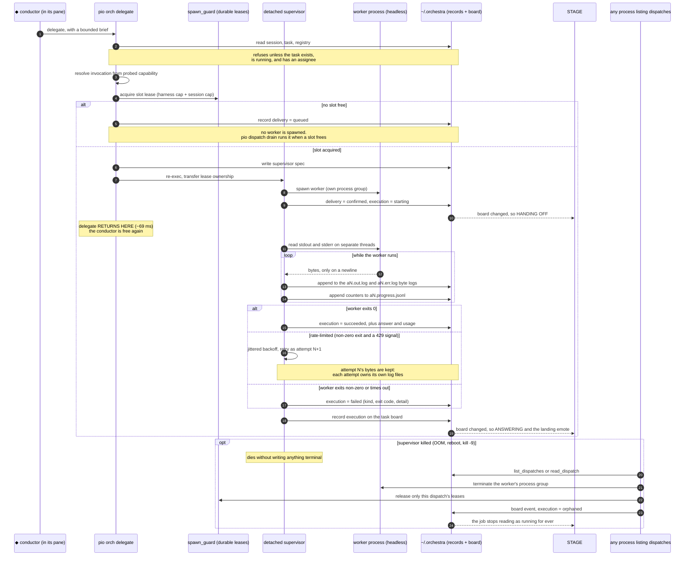
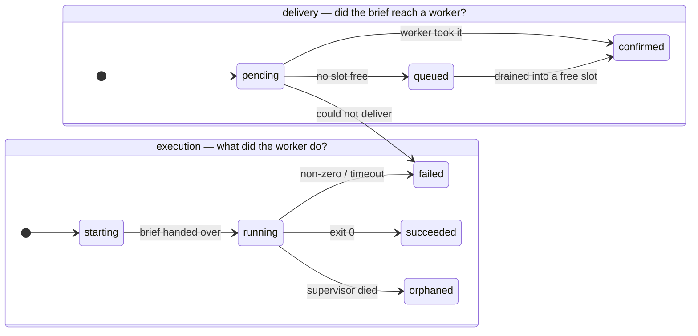

# The dispatch lifecycle

This is the hardest thing in the codebase to understand from the source, and the
most valuable thing to draw. It is what happens between a conductor typing
`delegate:` and an answer coming back.

Read [the two axes](#the-two-axes) first if you read nothing else.

## The whole thing, in one diagram



## The two axes

Every dispatch carries **two independent status fields**, not one. This is the
mechanical content of "confirmed, never assumed".



- `DeliveryStatus` — `orc-core/src/dispatch.rs:67`
- `ExecutionStatus` — `orc-core/src/dispatch.rs:86`

`confirmed` means *the worker process received the brief*. It does not mean the
work is done, and it never did — but until
[#49 phase 1](https://github.com/Legend101Zz/Agent-orchestra/issues/49) there was
no second axis, so STAGE hung its "answer arrived" animation on the only event
that existed: the worker's process starting. The result was that the board
reported the answer coming home about 100 ms after the job went out, every time,
regardless of how long the worker really took. The old wording even said so out
loud — *"delivered to hermes; worker running"*.

Measured on a worker deliberately told to take 1.5 s: hand-off confirmed at
**69 ms**, answer at **1.63 s**. Before that branch both were the same instant.

`ExecutionStatus::is_terminal` (`dispatch.rs:137`) is `succeeded | failed |
orphaned`. `orphaned` is deliberately distinct from `failed`, because a killed
supervisor means *nobody knows* what the worker had accomplished — which is a
different fact from "the work failed", and conflating them would be a lie the
board could not walk back.

## Why the caller returns early

`pio orch delegate` returns as soon as the brief is in the worker's hands. It
does not wait for the answer. That is the entire point: the expensive brain
stays free.

Making that safe took the piece of design most likely to be missed on a first
read — **the durable slot lease is transferred, not dropped**:

> `pio orch delegate` persists a private supervisor spec, re-execs the hidden
> `pio _dispatch_exec` command, and transfers its durable slot leases to that
> child. The supervisor owns the leases for the worker's *real* lifetime.
> — `orc-core/src/dispatch_supervisor.rs:1-8`

If the lease were released when the caller returned, `max_parallel_workers`
would mean nothing the moment delegation became non-blocking — you could start
an unbounded number of workers by returning fast enough. The lease outliving its
creator is what keeps the cap honest across detachment, across sessions, and
across every `pio` process on the machine.

Collect the answer with `pio orch status` (poll) or `pio orch await` (block).

## The per-attempt progress artifacts

While the worker runs, the supervisor writes **three files per attempt**:

```
~/.orchestra/dispatches/<session>/
  <id>.json                    the dispatch record (atomically rewritten)
  <id>.supervisor.json         the spec; deleted on reconcile
  <id>.a1.out.log              worker stdout bytes, append-only
  <id>.a1.err.log              worker stderr bytes, append-only
  <id>.a1.progress.jsonl       orchestrator counters, append-only
```

Paths at `orc-core/src/dispatch.rs:526`. The `aN` is the attempt ordinal, so a
rate-limited retry does not destroy what the previous attempt produced.

**Keeping the byte logs and the journal apart is the design, not tidiness.**
The two have different authorities:

| | holds | claim |
|---|---|---|
| `.aN.out.log` / `.aN.err.log` | worker bytes and *nothing else* — no timestamp, no counter, no label | *"the worker wrote these bytes to this stream, in this order, and byte N is byte N forever"* |
| `.aN.progress.jsonl` | orchestrator statements only — cumulative counters, one capability declaration, why the attempt ended | *"the supervisor observed these totals at this instant"* |

An append-only file never removes and never re-renders, so it structurally
cannot reproduce either lie the in-memory capture contains: `Captured::raw()`'s
tail pops from the front, so a mid-flight render is not a prefix of the final
one, and `Captured::result()` swaps raw transport for prose the first time an
extractor fires. And because the byte log contains no orchestrator bytes, there
is nothing in it for a worker to forge. The full argument is at
`orc-core/src/dispatch_progress.rs:11-38`.

**"Durable" here means flushed, not fsynced**, and the number is measured rather
than assumed: one `sync_all` costs ~4 ms against ~4 µs for a held-open unsynced
append. A SIGKILLed supervisor — the case that previously destroyed everything —
loses nothing already written; a power cut can lose the tail.

### The honesty floor

`drain_to_eof` reads `read_until(b'\n')`. Nothing is observable until a newline
arrives, and **whether one arrives is the child's decision.** Most runtimes
switch stdout from line-buffered to block-buffered when it is a pipe rather than
a TTY. Measured: a Python worker printing every 50 ms for two seconds delivered
its first line at **2.187 s** — i.e. nothing until exit — while the same worker
with `-u` delivered at **0.018 s**.

No persistence design can change that, because the bytes are in the child's
buffer, not in our pipe. So the vocabulary is scoped to what was probed: the
journal reports *lines and bytes observed*, a reader may say **"no complete line
observed since T"**, and the words "thinking", "quiet", "idle" and "no output"
are banned outright — with a test enforcing it. The four different ways there can
be nothing to show get four different sentences rather than one shrug.

Costs nothing on screen, and that was measured too because it was the thing most
likely to go wrong: 2,000 lines of live output produce **zero** extra writes to
the task board and **zero** to the dispatch record — the two things the screen
watches.

## Reconciliation: the reader is the writer

A killed supervisor leaves a worker alive in its own process group and a record
that says "running" for ever. Something has to notice.

That something is **whichever process lists dispatches next**:

> It runs from `list_dispatches` and `read_dispatch`, i.e. in any process that
> lists dispatches — so this function is where a read becomes a write.
> — `orc-core/src/dispatch.rs:1348`

That sounds alarming until you measure it. The set of processes that can notice
is three; all three already write to the board; and the event is written **at
most once per job** however many notice at the same moment. The two
tidier-sounding designs (a dedicated owner, a reaper daemon) are worse for
reasons written up in `findings.md` under 2026-07-31.

`reconcile_record` (`dispatch.rs:1356`) does four things, in this order:

1. terminate the worker's process group
2. release **only this dispatch's** leases
3. append the orphaning to the task board
4. write the dispatch record terminal, then delete the supervisor spec

Order 3-before-4 is load-bearing: it makes *"the dispatch is terminal"* imply
*"the board has been told"*, so a test can wait on one and assert the other
instead of racing them (`dispatch.rs:1379-1385`). And the slot-lock holds in
step 2 are scoped so that nothing ever takes the board lock and then a slot
lock — keeping the two lock orders disjoint is what makes the pair deadlock-free.

## What the board records

The task board gets durable events, not derived state:

| Event | Written by | Means |
|---|---|---|
| `record_delivery` | supervisor | the worker *took* the brief |
| `record_execution` | supervisor | the worker finished, and how |
| `record_review_delivery` | supervisor | a reviewer took the brief |
| `record_review_execution` | supervisor | the reviewer finished |
| orphan event | whichever reader reconciled | the supervisor died; nobody knows |

All in `orc-core/src/tasks.rs:923-1049`. A reviewed task therefore has **two**
workers on it, in two different panes — which is why the board carries two pane
links rather than one. Before [#51](https://github.com/Legend101Zz/Agent-orchestra/issues/51)
it had one, so a reviewer's verdict was drawn crossing the *executor's*
connector and stamping the executor's card with work it had not done.

## Retry

Rate-limit detection fires **only on a non-zero exit** (`orc-core/src/ratelimit.rs`).
That gate is not obvious and it is deliberate: without it, a worker that exits 0
with output merely *mentioning* `429` or "rate limit" — a diff summary, say, or
this very document — gets retried four times and reported `rate_limited`,
silently failing good work and quadrupling provider load. That was a real
review finding on [#7](https://github.com/Legend101Zz/Agent-orchestra/issues/7),
caught with a throwaway exit-0 test.

Each retry is a new attempt ordinal, so `a1`'s bytes survive `a2`.

## Where to look next

- [The capability model](capability-model.md) — how the invocation in step 3 gets built, and why a registry entry proves nothing.
- [The data model](data-model.md) — what all these files look like on disk.
- [The client](client.md) — how any of this reaches the screen.
